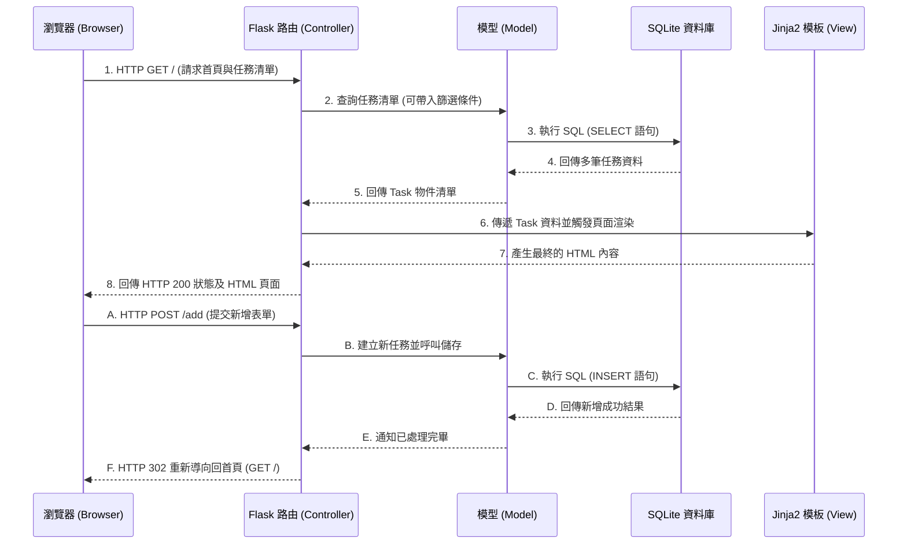

# 系統架構文件 (Architecture)：任務管理系統

## 1. 技術架構說明

本專案採用輕量級的 Python Web 框架 Flask 作為核心，搭配 Jinja2 模板引擎與 SQLite 資料庫，建立一個不需前後端分離的單體式應用程式 (Monolithic Application)。

### 1.1 選用技術與原因
- **後端框架：Flask**
  - **原因**：框架輕量、彈性高，適合快速開發 MVP 及個人單機使用的應用程式。不需要過度複雜的基礎設定。
- **模板引擎：Jinja2**
  - **原因**：內建於 Flask 生態系，語法直觀，可以直接在 HTML 中混入 Python 語法（如 if-else, for loop），非常適合用來渲染伺服器端資料。
- **資料庫：SQLite**
  - **原因**：不需要額外安裝及運行資料庫伺服器服務，資料直接儲存於一個實體檔案中，便於本地端開發、測試與備份。

### 1.2 Flask MVC 模式說明
雖然 Flask 本身並未強迫使用特定架構，但我們在專案中將遵循類似 MVC (Model-View-Controller) 的設計模式來組織程式碼：
- **Model (模型)**：負責與 SQLite 資料庫溝通，定義任務 (Task) 的資料結構（如：任務內容、狀態），並執行 CRUD 操作。
- **View (視圖)**：負責呈現使用者介面。在這個專案中，由 Jinja2 模板（`.html` 檔案）及前端靜態資源擔任。
- **Controller (控制器)**：由 Flask 的路由 (Routes) 扮演。接收來自瀏覽器的 HTTP 請求，調用對應的 Model 取得或更新資料，再將資料傳遞給 View 進行頁面渲染，最後回傳 HTML 給瀏覽器。

## 2. 專案資料夾結構

以下為專案資料夾的基本規劃：

```text
web_app_development/
├── app/                      # 應用程式主目錄
│   ├── __init__.py           # Flask app 的初始化及相關設定檔案
│   ├── models/               # 模型：負責資料庫相關邏輯
│   │   └── task.py           # 任務表格屬性與操作邏輯
│   ├── routes/               # 控制器：處理 HTTP 請求的路由
│   │   └── task_routes.py    # 新增、刪除、狀態更新及篩選等路由
│   ├── templates/            # 視圖：存放 Jinja2 HTML 樣板
│   │   ├── base.html         # 全局共用基礎樣板 (header、footer 等)
│   │   └── index.html        # 首頁面 (任務列表與操作區)
│   └── static/               # 前端靜態資源
│       ├── css/
│       │   └── style.css     # 客製化全局樣式
│       └── js/
│           └── main.js       # 基礎前端互動邏輯
├── instance/                 # 本地端專屬目錄 (需加入 .gitignore)
│   └── database.db           # SQLite 實體資料庫檔案
├── docs/                     # 專案文件
│   ├── PRD.md                # 產品需求文件
│   └── ARCHITECTURE.md       # 本系統架構文件
├── app.py                    # 專案啟動入口，負責啟動 Flask 開發伺服器
├── requirements.txt          # Python 第三方套件依賴清單
└── README.md                 # 專案說明文件
```

## 3. 元件關係圖

以下展示任務管理系統的資料流與元件互動過程：



## 4. 關鍵設計決策

1. **採用伺服器端渲染 (SSR)**
   - **原因**：針對初學者與一般輕量應用，使用 Flask + Jinja2 傳統渲染方式，不需設定龐雜的 Node.js/Vue/React 等前端開發環境，降低進入門檻且開發效率極高。
2. **採用 PRG (Post/Redirect/Get) 模式處理表單**
   - **原因**：當使用者提交「新增任務」、「刪除任務」或「變更狀態」的 POST 請求後，伺服器一律回傳 HTTP 302 重新導向至首頁 (`/`)。這能有效防止使用者在重整頁面時，不小心重複提交上一次的表單資料。
3. **路由與模型解耦 (Decoupling)**
   - **原因**：即使是輕量專案，也將資料庫操作邏輯收斂於 `models/` 中，而 `routes/` 僅扮演中介。這能讓程式碼變得好讀、好維護。
4. **統一依賴管理與虛擬環境**
   - **原因**：未來實作時必須使用 Python 虛擬環境 (如 `venv`) 與 `requirements.txt` 以確保套件版本一致，避免套件衝突或部署至其他伺服器時的錯誤。
