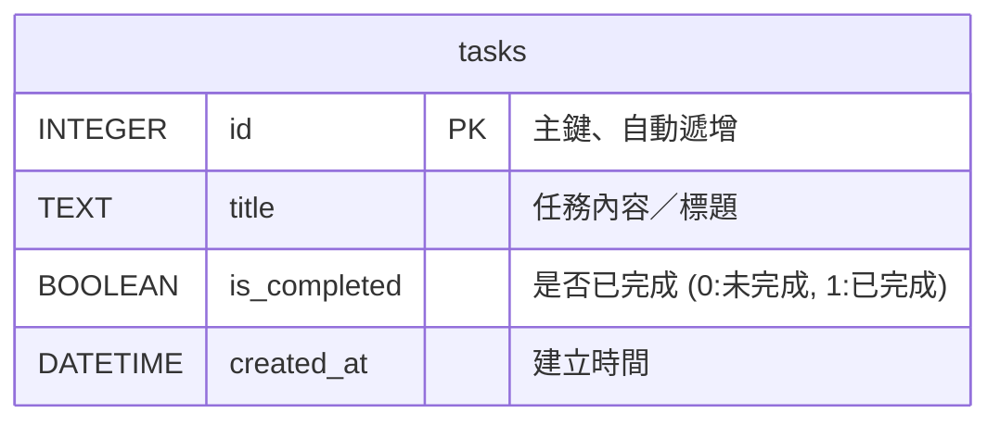

# 資料庫設計文件 (DB Design)：任務管理系統

## 1. ER 圖（實體關係圖）

本階段系統需求為單機個人使用，因此資料結構非常單純，僅需一張 `tasks` 資料表。未來的擴充需求（例如多使用者、分類任務等）可依據此基礎進行延伸。



## 2. 資料表詳細說明

### 2.1 `tasks` (任務主表)

這張表用來儲存使用者的每一筆待辦任務。

| 欄位名稱 | 型別 | 必填 | 預設值 | 說明 |
| :--- | :--- | :---: | :---: | :--- |
| `id` | `INTEGER` | 是 | *(Auto)* | **Primary Key**。自動遞增的任務唯一識別碼。 |
| `title` | `TEXT` | 是 | - | 任務的名稱或是內容標題，不允許為空。 |
| `is_completed` | `BOOLEAN` | 是 | `0` | 表示任務是否被使用者標記為完成。`0` 表示 `False`（未完成），`1` 表示 `True`（已完成）。 |
| `created_at` | `DATETIME` | 是 | `CURRENT_TIMESTAMP` | 系統插入記錄當下的時間，用以判斷任務新增順序並作排序使用。 |

## 3. SQL 建表語法

SQLITE 的建立語法已儲存於 `database/schema.sql` 檔案中，這份腳本在程式首次執行時會自動初始化 `instance/database.db` 實體檔案。

```sql
CREATE TABLE IF NOT EXISTS tasks (
    id INTEGER PRIMARY KEY AUTOINCREMENT,
    title TEXT NOT NULL,
    is_completed BOOLEAN NOT NULL DEFAULT 0,
    created_at DATETIME DEFAULT CURRENT_TIMESTAMP
);
```

## 4. Python Model 程式碼配置

根據先前的專案架構決定，我們使用原生的 `sqlite3` 套件來做資料庫存取。
對應的 Model 位於 `app/models/task.py`。包含以下核心方法供 Flask Controller (Route層) 呼叫：

- `TaskModel.get_all(status_filter=None)`: 取得任務列表，可傳入 `completed` 或 `uncompleted` 進行篩選。
- `TaskModel.create(title)`: 插入一筆新建立的任務並儲存。
- `TaskModel.toggle_status(task_id)`: 切換任務的狀態。
- `TaskModel.delete(task_id)`: 刪除給定 ID 的任務。
