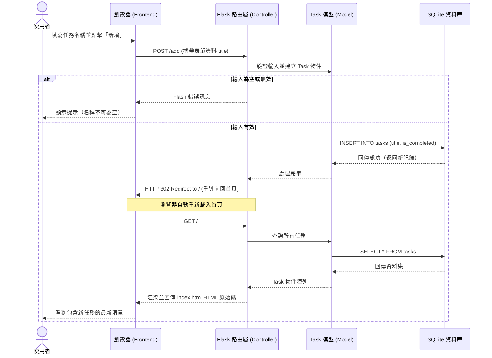

# 流程圖文件 (Flowcharts)：任務管理系統

## 1. 使用者流程圖（User Flow）

這張流程圖描述了使用者進入任務管理系統後，可以進行的各種操作路徑：

```mermaid
flowchart LR
    Start([使用者開啟網頁]) --> Home[首頁 - 任務列表]
    
    Home --> Filter{想要篩選任務？}
    Filter -->|點擊 狀態標籤| FilterAction[更新清單顯示結果<br/>(全部 / 已完成 / 未完成)]
    FilterAction --> Home

    Home --> Action{要執行什麼操作？}
    
    Action -->|新增任務| Add[在輸入框填寫任務內容]
    Add --> SubmitAdd[點擊「新增」按鈕]
    SubmitAdd --> Home
    
    Action -->|變更狀態| Toggle[點擊「完成 / 取消完成」按鈕]
    Toggle --> Home
    
    Action -->|刪除任務| Delete[點擊「刪除」按鈕]
    Delete -->|也可詢問確認| SubmitDelete[確認刪除並移除項目]
    SubmitDelete --> Home
```

## 2. 系統序列圖（Sequence Diagram）

以下序列圖描述了使用者進行「新增任務」的完整技術流程，展示從瀏覽器到資料庫的互動方式：



## 3. 功能清單對照表

對照 PRD 中的主要功能，以下是後端設計對應的 URL 路徑與 HTTP 請求方法，提供開發者作為實作 API/路由的對照：

| 功能描述 | HTTP 方法 | URL 路徑 | 功能說明與參數 | 頁面或回應行為 |
| :--- | :--- | :--- | :--- | :--- |
| **顯示所有任務清單** | `GET` | `/` | 取得任務，可依賴 Query 參數 (如 `?status=completed`) 進行篩選。 | 渲染首頁 `index.html`。 |
| **新增任務** | `POST` | `/add` | 接收表單提交的內容 (`title`)。 | 執行後 `HTTP 302` 重導向回 `/`。 |
| **標記任務狀態** | `POST` | `/action/<int:task_id>/toggle` | 針對特定 ID，在「已完成」與「未完成」間切換 (`is_completed`)。 | 執行後 `HTTP 302` 重導向回 `/`。 |
| **刪除任務** | `POST` | `/action/<int:task_id>/delete` | 接收指令並從資料庫中刪除指定 ID 的任務。 | 執行後 `HTTP 302` 重導向回 `/`。 |

> **開發設計提醒**：因為本系統目前依靠純 HTML `<form>` 來觸發狀態改變，表單原生的行為只支援 GET/POST，因此狀態變更和刪除動作目前採 `POST` 方法實作。這是單體式 Server-sider Rendering (SSR) 網站中常見的做法（PRG Pattern）。
